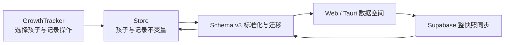

# Feature: 多孩家庭生长记录隔离

**作者**: Codex

**日期**: 2026-08-20

**状态**: Approved

---

## 1. 背景 (Background)
### 1.1 问题描述
- 当前生长曲线只有一份家庭级记录，身高、体重和头围数据没有孩子归属。
- 多孩家庭新增记录后，所有数据混合展示在同一趋势图和历史列表中；同一天也只能保存一条记录，无法分别跟踪每个孩子。
- 用户无法明确判断当前正在查看或编辑哪个孩子的数据，存在误录、误改和误删其他孩子记录的风险。

### 1.2 现状分析
- `src/components/GrowthTracker.vue` 直接读取完整的 `store.growthRecords`，摘要、趋势图、历史列表、日期判重、编辑和删除均没有孩子维度。
- `src/data/store.js` 使用 Schema v2，业务快照根字段为 `categories`、`links` 和扁平的 `growthRecords`；单条成长记录也没有孩子标识。
- 所有写入通过 Store 串行队列提交完整快照，并由数据空间仓库分别持久化到游客或登录账号空间。
- 登录用户的完整快照通过 Supabase 云同步；数据库保存通用 JSONB，不理解具体成长记录字段，因此无需新增数据库表。
- Web/Tauri 旧存储、JSON 导入、恢复副本和云端快照都会经过统一标准化；新增孩子维度必须兼容历史 Schema，并继续拒绝未来版本。
- 旧客户端会静默丢弃未知业务字段，因此多孩模型需要升级快照 Schema，防止旧版本覆盖新数据。

### 1.3 主要使用场景
- 首次升级后，用户原有的全部成长记录自动归入默认孩子“孩子 1”，记录不得丢失。
- 用户可新增多个孩子，并为每个孩子设置易识别的名称。
- 用户可在生长曲线中切换当前孩子，只查看该孩子的摘要、趋势图和历史记录。
- 用户为当前孩子新增、编辑或删除单条测量记录，不影响其他孩子。
- 用户修改孩子名称后，既有记录归属保持不变。
- 本地数据、JSON 导入导出、恢复副本及云同步均完整保留孩子与记录的归属关系。

## 2. 目标 (Goals)
- 为生长曲线增加清晰的孩子档案维度，使多孩家庭可以安全地切换、记录和查看每个孩子的独立成长数据。
- 保证现有单孩数据无损升级，且本地持久化、账号空间隔离、导入导出和云同步行为保持一致。

### 2.1 非目标 (Non-Goals)
- 本期不提供删除孩子功能，避免未定义的级联删除或记录转移造成数据丢失。
- 不把首页成长阶段筛选与当前孩子自动绑定。
- 不增加医学百分位、诊断、年龄计算、生日、性别或头像等档案字段。
- 不改变现有身高、体重、头围、日期和备注的取值规则。
- 不修改 Supabase 数据库表结构，也不做孩子级增量云同步或冲突合并。

## 3. 需求细化 (Requirements)
### 3.1 功能性需求
- 系统至少保留一个孩子档案；历史快照缺少孩子信息时，自动创建确定性的默认孩子“孩子 1”。
- 默认孩子可以改名；孩子名称去除首尾空白后必须非空，并限制合理长度。
- 用户可以新增孩子；新增后可主动切换到该孩子并开始记录。
- 生长曲线必须明确展示当前孩子，并提供可通过键盘操作的切换入口。
- 摘要、趋势图、历史记录和空状态只基于当前孩子的数据计算。
- 新增记录自动归属当前孩子；同一测量日期只在当前孩子范围内判重，不同孩子可保存同日记录。
- 切换孩子时必须结束当前编辑状态、清空错误并重置表单，防止跨孩子误保存。
- 编辑和删除记录时必须校验记录属于当前孩子，禁止通过旧引用修改其他孩子的数据。
- 修改孩子名称不得改变孩子 ID 或记录归属。
- JSON 导入必须接受历史 Schema 并迁移到默认孩子；当前 Schema 导入必须校验孩子 ID 唯一、名称合法、至少一个孩子及记录引用有效。
- 导出、恢复副本、本地数据空间切换和云同步必须保留全部孩子档案与记录归属。
- 导入覆盖确认文案必须明确会覆盖资源、分类、孩子档案和生长记录。

### 3.2 非功能性需求
- **数据安全**：升级、导入、同步、冲突恢复和空间切换不得丢失现有成长记录或改变其默认孩子归属。
- **兼容性**：升级后的客户端可读取历史快照并迁移；旧客户端必须拒绝未来快照，不能静默剥离多孩字段后覆盖。
- **确定性**：默认孩子 ID 和迁移结果必须跨设备稳定，保证相同历史快照产生相同规范化结果和 hash。
- **一致性**：孩子档案与成长记录继续随整份业务快照原子提交；不在独立步骤中分别保存。
- **隔离性**：不同游客/登录账号数据空间继续完全隔离；同一空间内不同孩子的 CRUD 互不影响。
- **可访问性**：孩子切换、新增和改名可使用键盘完成，并提供明确标签、焦点与状态提示。
- **响应式**：孩子选择与管理入口在 375px 移动端不产生横向滚动，不压缩现有图表和表单的基本可用空间。
- **资源限制**：继续遵循现有本地快照约 2 MiB、Tauri 空间约 2.25 MiB 和云端 JSONB 约 4 MiB 的限制。
- **可回滚性**：Schema 升级前保留现有恢复副本机制；一旦写入新 Schema，旧版本不得继续写入该快照。

## 4. 设计方案 (Design)
### 4.1 方案概览
- 将业务快照从 Schema v2 升级为 v3，在现有 Store 中新增独立的孩子档案集合，并为每条成长记录增加稳定的 `childId`。成长记录继续保持扁平数组，界面先按当前孩子过滤，再复用现有摘要和图表工具。
- `store.js` 继续拥有孩子档案与成长记录的一致性不变量；`GrowthTracker.vue` 只管理当前选中孩子和交互状态，不直接修改原始数组。
- 历史 v1/v2 快照在标准化入口统一迁移：创建确定性默认孩子，将全部旧成长记录归入该孩子，再生成 v3 快照。未来版本继续 fail-closed。
- 本地数据空间、恢复副本、导入导出和 Supabase 云同步仍传递整份规范化快照，不增加新的数据库表、网络接口或孩子级同步协议。



模块边界：

- **展示层**：孩子选择、新增、改名、当前孩子摘要/图表/历史和表单状态。
- **业务 Store**：孩子 CRUD、记录归属校验、原子快照提交和响应式状态更新。
- **Schema 层**：v1/v2→v3 迁移、当前结构校验、确定性默认值和未来版本拒绝。
- **持久化/同步层**：只处理通用快照，不理解孩子业务语义；通过统一标准化函数获得 v3 数据。

依赖方向保持为 `UI → Store → Schema 标准化 → 数据空间 / 云同步`，不让图表工具、数据库或 Rust 层反向依赖孩子管理逻辑。

关键取舍：

- 选择“孩子集合 + 扁平成长记录”而非把记录嵌套进孩子对象，最大化复用现有图表、排序和 CRUD 逻辑。
- 升级 Schema 版本而非在 v2 静默加字段，牺牲旧版回写兼容性，换取防止旧客户端剥离多孩字段后覆盖数据。
- 不持久化当前选中孩子；选择状态仅属于界面会话，避免把展示偏好混入业务快照。
- 继续整快照同步，不做孩子级合并；实现简单且符合现有冲突/恢复机制，但并发设备仍按整份数据处理冲突。
### 4.2 组件设计 (Component Design)
#### 4.2.1 核心类/模块设计
- `src/data/store.js`
  - 升级并标准化 Schema v3，维护 `growthChildren` 与 `growthRecords` 的引用完整性。
  - 提供孩子新增、改名以及带孩子归属校验的记录新增/编辑/删除操作。
  - 所有操作继续进入现有串行写队列，并在一次完整快照提交中更新孩子和记录。
- `src/components/GrowthTracker.vue`
  - 管理当前孩子、孩子选择器、新增/改名表单以及当前孩子的记录编辑状态。
  - 只消费 Store 提供的孩子和记录，不承担持久化或迁移；通过 `activeSpaceKey` 和权威替换 generation 失效旧交互状态。
  - 在当前孩子切换时重置编辑/错误/表单，避免旧引用跨孩子写入。
- `src/sync/snapshot.js`
  - 将当前支持版本升级为 3；规范化后的快照必须严格为 v3。
  - 提供“历史版本可迁移、未来版本拒绝”的版本边界，供本地和云端适配器复用。
- `src/data/dataSpaceRepository.js`
  - 允许 v1/v2 原始快照进入统一迁移，拒绝大于 v3 的快照。
  - 继续负责原子本地空间写入、恢复副本和大小校验，不理解孩子业务字段。
- `src/sync/cloudSnapshotRepository.js`
  - 在 payload 与数据库 `schema_version` 一致的前提下，先验证原始 v1/v2 payload hash，再迁移到 v3 并执行规范化大小校验。
  - 上传始终只接受规范化后的 v3 快照。
- `src/utils/growthChart.js`
  - 保持不变；由 `GrowthTracker` 传入当前孩子过滤后的记录。
- `src/App.vue`
  - 仅修正覆盖式导入提示，明确包含孩子档案和生长记录。

不新增继承层或独立状态库，沿用现有 Vue reactive Store 和纯函数标准化边界。

#### 4.2.2 接口设计
Store 快照接口保留现有前三个位置参数兼容性，仅把孩子集合放在第四个参数：

```text
store.getSnapshot(
  categories = store.categories,
  links = store.links,
  growthRecords = store.growthRecords,
  growthChildren = store.growthChildren
) -> SchemaV3Snapshot
```

新增 Store 操作：

```text
store.addGrowthChild(child, { expectedDataGeneration? }) -> Promise<boolean>
store.renameGrowthChild(childId, name, updatedAt, { expectedDataGeneration? }) -> Promise<boolean>
store.upsertGrowthRecord(recordWithChildId, { expectedDataGeneration? }) -> Promise<boolean>
store.deleteGrowthRecord(recordId, childId, { expectedDataGeneration? }) -> Promise<boolean>
```

契约约束：

- `addGrowthChild` 校验 ID、名称、数量上限和 ID/名称唯一性；成功后原子提交快照。
- `renameGrowthChild` 只修改名称和 `updatedAt`，不修改 ID；不存在或重名返回/抛出明确失败。
- `upsertGrowthRecord` 要求 `childId` 引用现有孩子；编辑已有记录时禁止改变其孩子归属。
- `deleteGrowthRecord` 同时接收记录 ID 与当前孩子 ID，只有归属匹配才允许删除。
- UI 提交时携带 `expectedDataGeneration`；权威导入/云端/恢复/外部重载先发生时，Store 在 mutation queue 内拒绝旧写入。
- UI 不直接持有或暴露数据空间键、用户 ID、云 revision 或恢复副本细节。
- 既有分类/链接 Store API 不变，避免 Schema 升级扩散到非成长业务。

#### 4.2.3 数据模型
Schema v3 根结构：

```js
{
  schemaVersion: 3,
  categories: [...],
  links: [...],
  growthChildren: [
    {
      id: 'growth-child-default',
      name: '孩子 1',
      createdAt: 0,
      updatedAt: 0
    }
  ],
  growthRecords: [
    {
      id: 'growth-...',
      childId: 'growth-child-default',
      measuredAt: '2026-08-20',
      heightCm: 105.5,
      weightKg: 16.8,
      headCircumferenceCm: null,
      note: '',
      createdAt: 0,
      updatedAt: 0
    }
  ]
}
```

孩子约束：

- `id` 为 1～100 字符的字母、数字、`-`、`_`，快照内唯一。
- 默认孩子 ID 固定为 `growth-child-default`，迁移不使用随机值。
- `name` trim 后为 1～20 个 Unicode 字符，同一快照内名称唯一。
- 至少一个孩子，最多 20 个孩子。
- `createdAt`、`updatedAt` 为非负有限数字；历史默认孩子统一使用 0，保证迁移确定性。

成长记录新增约束：

- `childId` 必须引用 `growthChildren.id`。
- 记录 ID 在整个快照中保持唯一。Schema v3 可承载迁移产生的历史同日记录以保证无损 round-trip；Store 禁止新增同孩同日记录，也禁止把既有记录改到已占用日期，但允许历史重复记录在日期不变时编辑其他字段。不同孩子允许同日记录。

Schema 演进：

- v1/v2 或未带版本的历史快照：确定性创建默认孩子，所有旧 `growthRecords` 补充默认 `childId`，输出 v3。
- v3：严格校验孩子集合、名称/ID 唯一性、记录引用和现有测量字段。
- v4+：本地、导入和云端一律返回 `UNSUPPORTED_SCHEMA`，不尝试降级。
- 数据库存储仍为 `user_snapshots.payload` JSONB，不新增索引或 DDL。

#### 4.2.4 并发模型
- 浏览器仍使用 Vue 单线程事件循环；孩子和记录写操作统一进入 Store 现有 mutation queue。
- 每次操作基于队列执行时的最新 `growthChildren` 和 `growthRecords` 构建新快照，避免并发新增孩子或记录互相覆盖。
- 孩子与记录在同一次 `commitData` 中原子保存；不得先保存孩子再单独保存记录。
- 云同步仍对完整快照执行 debounce、单飞、CAS revision 和冲突处理，不新增孩子级锁或字段级合并。
- 切换孩子只改变组件内选择状态，不触发持久化或云同步；切换发生时递增/重置编辑状态，迟到保存通过 Store 的归属校验拒绝跨孩子覆盖。

#### 4.2.5 错误处理
- 孩子名称为空、超长、重复，孩子数量超限或 ID 非法：在网络/持久化前拒绝，表单显示可理解提示。
- 记录引用不存在的孩子、编辑时试图改变归属、删除归属不匹配：视为不可重试的数据契约错误，不修改当前快照。
- v3 快照孩子集合缺失、为空、ID/名称重复或记录悬空引用：严格导入直接拒绝；本地/云端加载进入现有损坏数据隔离与恢复副本流程。
- 历史 v1/v2 快照缺少孩子维度：属于可迁移状态，不提示错误；标准化后首次成功保存为 v3。
- 本地写入失败、revision 冲突、云端失败和恢复失败：沿用现有 AppError 与补偿机制；孩子/记录的 reactive 状态只在完整快照保存成功后更新。
- UI 新增或改名失败时保留输入并显示错误；记录保存失败时保留原表单；切换孩子不自动重试未完成写入。
### 4.3 核心逻辑实现
#### 快照标准化与迁移

1. 读取原始 `schemaVersion`；缺失版本按历史版本处理，大于 3 立即拒绝。
2. v1/v2 进入确定性迁移路径：创建固定默认孩子，将每条旧成长记录补充 `childId=growth-child-default`。
3. v3 标准化孩子集合，单次构建 child ID Set 和规范化名称 Set，校验数量、唯一性和字段范围。
4. 标准化成长记录；v3 的每条记录必须引用已有 child ID。历史记录迁移到默认孩子，重复记录 ID 使用确定性后缀重命名，历史同日记录保留。
5. 输出字段顺序稳定、数组顺序保持不变的 Schema v3 快照，再进入 canonicalize、大小校验、hash、本地保存或云同步。
6. 云端历史行先验证 `row.schema_version === payload.schemaVersion`，再迁移到 v3；hash 仍针对云端原始 payload 验证，迁移后的快照在本地首次写入时形成新的 v3 revision。

#### Store 写入

1. 所有孩子与记录操作进入现有 mutation queue。
2. 新增/改名孩子时基于队列内最新集合校验名称和 ID，再构建完整 v3 快照。
3. 新增记录时校验 child ID 存在；更新记录时查找原记录并确认 child ID 未改变。
4. 删除记录时同时匹配 `recordId + childId`，不允许只凭旧记录 ID 跨孩子删除。
5. `commitData` 只在持久化成功后一次性替换 `categories`、`links`、`growthChildren` 和 `growthRecords`，然后触发本地提交事件。

#### UI 交互

1. 弹窗初始化时选择当前仍存在的孩子；无有效选择时回到孩子数组第一项。
2. 当前记录由 `growthRecords.filter(record => record.childId === activeChildId)` 得到，再按日期排序并传给现有图表与摘要函数。
3. 切换孩子前重置编辑 ID、错误和测量表单；孩子管理表单也退出，焦点回到明确入口。
4. 新增孩子成功后切换到新孩子；改名成功后保留当前选择。
5. 日期判重、查找既有记录、编辑和删除全部基于当前孩子记录集合。

复杂度与性能：

- 迁移/标准化为 `O(C + R)`，其中 C 为孩子数（最大 20），R 为成长记录数；只构建一次引用 Set，不做嵌套全量查找。
- 当前孩子过滤为 `O(R)`，日期排序为 `O(R log R)`，与现有单数组排序同阶；家庭成长记录规模远低于 2 MiB 快照上限，无需新增索引或缓存。
- Store 写操作继续复制扁平数组并完整规范化，优先保持确定性和原子性；不引入会增加失效复杂度的派生缓存。
- UI 不在模板内重复过滤，使用单一 computed 结果供摘要、图表、历史和判重复用。

### 4.4 方案优劣分析
优点：

- 历史记录自动迁移且归属确定，不要求用户手工整理旧数据。
- 孩子集合和记录扁平化，改动集中在 Schema、Store 和成长曲线组件，图表、数据库、Rust 层无需重写。
- Schema v3 让旧客户端明确拒绝未来数据，避免静默丢弃 `childId` 后覆盖云端。
- 孩子与记录继续随完整快照原子保存，复用现有数据空间、恢复副本和 CAS 冲突机制。
- Store 负责归属不变量，即使 UI 存在迟到事件，也不能跨孩子修改记录。

局限：

- 云同步仍是整快照冲突，不支持两个设备分别编辑不同孩子后自动合并。
- 当前孩子选择不跨页面刷新持久化，每次新会话默认选择第一个孩子。
- 本期不支持删除孩子；需要删除时必须先明确记录转移或级联删除策略。
- Schema v3 写入后旧客户端无法继续使用该快照，Tauri 旧版本需升级才能恢复访问。
- 所有家庭成员仍共享同一账号空间；本功能隔离孩子数据，不提供家庭成员级权限控制。

## 5. 备选方案 (Alternatives Considered)
- **在 v2 记录上直接增加 `childId`**：改动较少，但旧客户端会在标准化时剥离未知字段并重新保存，可能永久破坏多孩归属，因此拒绝。
- **把记录嵌套到每个孩子对象**：结构直观，但需要重写现有记录 CRUD、图表输入、导入校验和更多测试；扁平记录加引用能以更小改动实现同等隔离。
- **每个孩子使用独立本地/云端快照**：天然隔离且冲突粒度更小，但会扩张数据空间键、账号同步、恢复副本和云端 revision 模型，超出本期范围。
- **新增 Supabase children/growth_records 业务表**：可做服务端查询和增量同步，但需要新的 RLS、离线缓存和冲突协议；当前数据量与本地优先架构不需要这类复杂度。
- **只在 UI 按记录上的孩子名称过滤**：名称可修改且不唯一，不能作为稳定引用，也无法保护 Store 层跨孩子误写，因此拒绝。

## 6. 业界调研 (Industry Research)

> **注意**：本章节应在完成自主设计后填写，用于验证方案、确保下限，而非作为设计的起点。

### 6.1 业界方案
- Redux 官方“Normalized State Shape”建议把有关系的实体按稳定 ID 组织，并在关联对象中保存 ID 引用，而不是深层嵌套；客户端规模下通过一次循环按外键筛选通常足够高效。
- Supabase 官方说明 JSONB 适合保存可演进或可变结构，但数据完整性责任会更多落到应用代码；当字段和查询已固定时，关系型字段更有优势。
- 本项目云端只按用户 revision 保存/替换完整业务快照，不对孩子或成长记录执行服务端查询，因此继续使用 JSONB 快照、在客户端执行严格 Schema 校验，符合现有架构边界。

### 6.2 对比分析
- “孩子集合 + 记录 childId”与规范化状态中的稳定 ID/外键模式一致，避免名字作为关联键，也避免嵌套对象更新导致大范围重建。
- 没有进一步改造成 `byId/allIds` Map，是因为当前 Store、导出格式和图表均使用数组，数据量很小；保留数组可减少迁移和兼容成本。
- Supabase 提醒 JSONB 的完整性主要由应用承担，因此 v3 标准化必须显式校验孩子唯一性、记录引用和版本，不依赖数据库自动保证关系。
- 若未来需要服务端按孩子查询、跨家庭权限或大量记录分页，应重新评估独立关系表；当前整快照同步场景不需要为未来假设提前增加 DDL 和 RLS 复杂度。
- 需要避免的主要风险是稳定 ID 缺失、旧客户端静默剥离字段、随机迁移结果导致 hash 不一致，以及 UI 过滤正确但 Store 缺少归属校验。

## 7. 测试计划 (Test Plan)
### 7.1 单元测试
- Schema v1/v2 正常迁移：确定性默认孩子、全部旧记录归属、原输入不被修改、重复标准化结果一致。
- Schema v3 正常路径：多孩快照 round-trip，记录引用、同日不同孩子、Unicode 名称和时间字段保持。
- 边界：1/20 个孩子、1/20 个 Unicode 字符名称、零时间戳、空成长记录、闰日测量日期。
- 异常：空白/超长/重复名称、非法/重复 ID、0 或 21 个孩子、记录悬空引用、记录重复 ID、未来 v4。
- Store CRUD：新增和改名成功；不同孩子同日记录成功；编辑不得改变 childId；错误 childId 删除不生效；持久化失败不更新 reactive 状态。
- UI 辅助状态：切换孩子后编辑状态与表单重置，当前孩子过滤结果供判重/图表/历史共同使用。

### 7.2 集成测试
- Web 数据空间从 v2 加载后生成 v3，迁移结果写入游客/用户空间且恢复副本完整。
- 云端 v2 行允许下载并迁移，payload hash 仍按原始 v2 校验；v3 上传和 CAS 保留全部孩子归属；v4 拒绝。
- Tauri v2 文件读取后迁移为 v3，原 legacy 文件继续保留，恢复副本可恢复多孩快照。
- JSON v2 导入自动迁移；v3 严格导入校验引用；导出后再次导入数据一致。
- 浏览器桌面和 375px：新增孩子、改名、切换、同日分别记录、图表/历史隔离、切换时表单重置、键盘操作和无横向滚动。

### 7.3 性能测试（如适用）
- 接近 2 MiB 的 v3 快照标准化与本地加载 P95 继续不超过 300ms。
- 20 个孩子和大量记录的迁移/引用校验保持线性，不出现按孩子×记录的嵌套扫描。
- 不因孩子切换触发持久化、云同步或重复图表计算。

## 8. 可观测性 & 运维 (Observability & Operations)

### 8.1 可观测性
- **日志**：复用现有诊断日志，只记录 Schema 版本、迁移/导入/恢复错误码和数据空间摘要；禁止记录孩子名称、测量值或备注。
- **监控指标**：不增加远程指标。现有同步状态继续反映 v3 快照上传、冲突和恢复结果。
- **告警**：本地功能不新增告警；云端连续出现 `UNSUPPORTED_SCHEMA`、`INVALID_REMOTE_DATA` 或恢复失败时按现有同步异常处理。

### 8.2 配置参数 (Configuration)
| 参数名 | 类型 | 默认值 | 说明 | 是否支持动态修改 |
|--------|------|--------|------|------------------|
| 无 | - | - | 本功能不新增运行时配置或 Feature Flag | - |

### 8.3 运维接口 (Operations Interfaces)
- 不新增命令、HTTP API 或数据库运维接口。
- 用户继续通过现有 JSON 导出、恢复副本和云同步中心完成备份与恢复。
- 诊断导出只包含 Schema 与同步状态摘要，不包含孩子和测量业务数据。

### 8.4 运维注意事项 (Operations Considerations)
- **升级兼容性**：先发布能读 v1/v2 并写 v3 的 Web 客户端；Tauri 旧版本在遇到 v3 时明确拒绝，用户需升级。数据库无需 migration。
- **回滚方案**：代码发布前依赖现有恢复副本；生产写入 v3 后不能直接回滚到只支持 v2 的旧客户端。紧急时关闭入口并恢复已验证的 v2 副本，而不是让旧版本覆盖 v3。
- **资源影响**：每个孩子增加少量元数据，每条记录增加一个 childId；CPU 仅增加线性校验和当前孩子过滤，仍受原快照大小限制。
- **故障处理**：迁移/导入失败时不覆盖当前空间；本地损坏优先恢复最近副本；云端版本或引用非法时停止覆盖并展示现有同步异常。

## 9. Changelog
| 日期 | 变更内容 | 作者 |
|------|----------|------|
| 2026-08-20 | 完成多孩生长记录隔离需求与系统设计 | Codex |

## 10. 参考资料 (References)
- [Redux: Normalizing State Shape](https://redux.js.org/usage/structuring-reducers/normalizing-state-shape)
- [Supabase: Managing JSON and unstructured data](https://supabase.com/docs/guides/database/json)
- `docs/design-docs/platform/account-sync/spec.md`
- `docs/design-docs/frontend/visual-refresh/spec.md`
