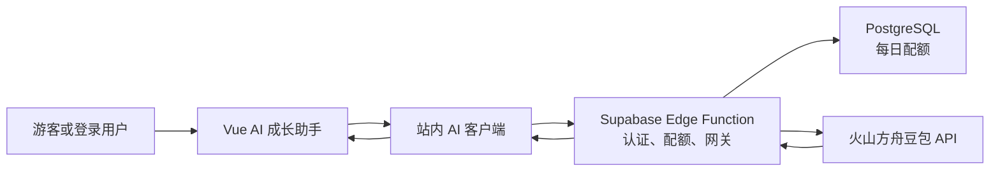

# Feature: 站内 AI 成长助手

**作者**: Codex

**日期**: 2026-08-19
**状态**: Approved

---

## 1. 背景 (Background)
### 1.1 问题描述
- 当前 AI 成长助手默认在页面内嵌豆包网页，用户仍需登录豆包，体验割裂且受第三方页面兼容性影响。
- 备用 OpenAI 模式要求用户自行填写 API Key，并由浏览器直接请求模型服务，不适合作为面向普通用户的正式能力。
- AI 模块当前位于首页主要内容导航之前，视觉优先级高于“实用工具、最近收录、热门主题”等核心内容。

### 1.2 现状分析
- `src/components/AISearch.vue` 同时维护豆包 iframe、OpenAI 直连、服务商设置和临时 API Key，回答在前端以纯文本展示。
- `src/components/Dashboard.vue` 在内容 Tab 之前渲染 `AISearch`。
- 项目已有 Supabase Auth、持久化 Session、PostgreSQL、Edge Function 部署目录基础和生产环境变量管理能力，但尚无 AI 服务端网关与用量限制。
- 现有账号门面不暴露原始 token；AI 调用应复用 Supabase 客户端自动携带的 Session，不把凭据扩散到组件。

### 1.3 主要使用场景
- 游客在首页体验少量站内问答，不离开潘多拉。
- 已登录用户在站内获得更高的每日调用额度。
- 用户询问育儿、成长、资源整理等问题，并在当前页面阅读回答。
- 模型服务不可用时，用户仍可继续使用本地资源库和其他工具。

## 2. 目标 (Goals)
- 将 AI 成长助手改造成站内闭环问答，消除豆包账号跳转和用户自备 API Key 的门槛。
- 复用现有 Supabase 账号体系，以最小服务端能力保护模型密钥、控制成本，并确保个人数据默认不发送给模型。
- 调整首页信息层级，将核心内容导航放在 AI 助手之前。

### 2.1 非目标 (Non-Goals)
- 不保存或同步问答历史。
- 不上传收藏、成长记录、资源快照或其他个人数据作为模型上下文。
- 不实现多轮会话、联网搜索、知识库检索、语音或图片问答。
- 不支持用户在页面选择模型服务商或填写自己的 API Key。
- 不承诺 AI 回答可以替代医生、教师或其他专业人士的判断。

## 3. 需求细化 (Requirements)
### 3.1 功能性需求
- 用户在首页输入当前问题后，回答直接显示在潘多拉页面内。
- AI 助手位于“实用工具、最近收录、热门主题、精选资源、我的收藏”等内容之后。
- 前端通过站内 AI 客户端调用 Supabase Edge Function，不直接调用火山方舟。
- Edge Function 使用服务端 Secret 调用火山方舟豆包模型，并返回纯文本回答及剩余额度。
- 登录用户通过 Supabase Session 识别，默认每天最多 20 次；游客默认每天最多 3 次。
- 游客身份只用于限额，服务端不得保存原始 IP、邮箱、问题或回答。
- 单次问题去除首尾空白后必须为 1～500 个字符；只向模型发送当前问题和固定系统提示词。
- 网络错误、超时、限流、模型错误和配置缺失必须转换为用户可理解的中文提示。
- 保留常用问题、当前设备内的最近搜索以及医疗免责声明。
- AI 配置不可用时隐藏不可操作的服务商设置，并保持其他首页功能正常。

### 3.2 非功能性需求
- **安全**：火山方舟 API Key 只能存在于 Supabase Secrets；前端产物、Git 和日志不得包含密钥。
- **隐私**：默认只传输当前问题；日志只记录 request id、结果状态、耗时、额度类型等非内容字段。
- **成本**：游客和登录用户分别实施持久化日配额；并发请求的额度扣减必须原子化。
- **可靠性**：模型请求必须设置超时，不自动重试非幂等模型调用；失败不得影响本地数据和账号同步。
- **兼容性**：Web 与 Tauri 共用前端接口；本地未配置 AI 服务时可明确降级。
- **可维护性**：前端依赖稳定的站内 DTO，不感知火山方舟原始响应；模型可通过服务端配置替换。
- **可访问性**：输入、提交、加载、错误和回答区域支持键盘与屏幕阅读器。

## 4. 设计方案 (Design)
### 4.1 方案概览
采用“薄前端 + 服务端 AI 网关”的单向依赖结构。Vue 只负责问题输入和回答展示；Supabase Edge Function 负责身份识别、配额、模型提示词、火山方舟调用和错误归一化；PostgreSQL 只保存不可逆的调用主体标识、日期和次数，不保存问题或回答。



模块边界：

- **展示层**：保留输入、常用问题、本机历史、加载/错误/回答和免责声明，不感知模型、密钥、配额存储或 JWT 细节。
- **前端应用层**：复用同一个 Supabase 客户端调用 Edge Function，校验站内响应 DTO，并统一映射超时、限流和服务不可用。
- **AI 网关层**：从可信认证信息识别登录用户；游客按服务端派生的匿名标识限额；校验输入并调用固定模型。
- **配额层**：以原子操作消费每日额度，防止并发请求绕过限制；只保存哈希标识和计数。
- **模型适配层**：火山方舟 API Key 和模型 ID 仅来自服务端 Secret，原始响应不直接返回前端。

依赖方向保持为 `UI → 站内客户端 → Edge Function → PostgreSQL / 火山方舟`，页面和现有业务 Store 不直接依赖模型服务，账号同步也不依赖 AI 可用性。

关键取舍：

- 使用现有 Supabase 而非新增独立服务器，减少部署和账号集成成本，但接受 Edge Function 冷启动与平台配额限制。
- 首版使用非流式单轮问答，降低实现与故障恢复复杂度；代价是长回答的首字等待时间较长。
- 游客额度只能降低滥用，不能形成强身份；登录账号额度才是可靠计费边界。
- 配额在模型调用前原子扣减，避免并发超额；上游超时不自动重试，防止重复调用产生额外费用。
### 4.2 组件设计 (Component Design)
#### 4.2.1 核心类/模块设计
- `AISearch.vue`：纯展示组件，管理输入、加载、回答、错误、本机历史和剩余额度；不感知 Session token、模型协议或服务端密钥。
- `AiAssistantClient`：前端应用服务，获取 Supabase Session、构造站内请求、处理 deadline/取消、校验响应并映射稳定错误码。
- `main.js` 组合根：创建并共享 Supabase Client Provider，同时注入账号同步和 AI 客户端；组件不直接创建基础设施对象。
- `ai-growth-assistant` Edge Function：服务端编排入口，负责 CORS、请求校验、可选认证、主体哈希、配额预占、模型调用和脱敏日志。
- `ArkClient`：火山方舟适配器，仅负责 HTTP 协议、deadline、请求/响应限制及上游错误归一化。
- `QuotaRepository`：通过 PostgreSQL RPC 原子预占额度和识别重复 `requestId`，不在远程模型调用期间持有事务。

各模块使用组合而非继承；AI 不进入账号门面或业务 Store，避免与本地数据生命周期形成双向依赖。

#### 4.2.2 接口设计
前端接口：

```text
AiAssistantClient.ask(question, { signal? })
  -> Promise<{
       requestId: string,
       answer: string,
       quota: { actorType: "guest" | "user", limit: number, remaining: number }
     }>
```

- `question`：trim 后 1～500 个 Unicode 字符。
- 同一客户端同一时间只允许一个请求；新请求由 UI 明确取消旧请求后发起。
- 客户端生成 UUID `requestId` 和仅保存在当前浏览器的 UUID `guestId`。

Edge Function HTTP 契约：

```http
POST /functions/v1/ai-growth-assistant
Content-Type: application/json
Authorization: Bearer <user JWT 或 publishable key>

{
  "question": "当前问题",
  "requestId": "UUID",
  "guestId": "UUID"
}
```

成功响应：

```json
{
  "requestId": "UUID",
  "answer": "纯文本回答",
  "quota": {
    "actorType": "user",
    "limit": 20,
    "remaining": 19
  }
}
```

错误响应统一为 `{ "requestId", "code", "message", "retryAfterSeconds?" }`，不得返回火山方舟原始响应、堆栈、JWT、邮箱或内部配置。

| HTTP | 错误码 | 说明 |
|---|---|---|
| 400 | `AI_INVALID_REQUEST` | JSON、字段、UUID 或问题长度无效 |
| 401 | `AI_SESSION_INVALID` | 携带的用户 JWT 无效或过期 |
| 409 | `AI_DUPLICATE_REQUEST` | 同一 `requestId` 已预占额度，禁止重复调用模型 |
| 429 | `AI_QUOTA_EXCEEDED` | 当日额度已用完 |
| 502 | `AI_PROVIDER_ERROR` | 模型返回明确失败或无效响应 |
| 503 | `AI_NOT_CONFIGURED` | 服务端密钥、模型或必要配置缺失 |
| 503 | `AI_SERVICE_UNAVAILABLE` | 配额或内部依赖暂时不可用 |
| 504 | `AI_TIMEOUT` | 模型调用超时，结果状态不确定 |

#### 4.2.3 数据模型
新增 `public.ai_request_usage`：

| 字段 | 类型 | 约束 | 说明 |
|---|---|---|---|
| `request_id` | `uuid` | PRIMARY KEY | 幂等键，不含业务含义 |
| `actor_hash` | `text` | 64 位小写十六进制 | 服务端 HMAC 后的主体标识 |
| `actor_type` | `text` | `guest` / `user` CHECK | 额度类型 |
| `usage_date` | `date` | NOT NULL | UTC 计费日期 |
| `created_at` | `timestamptz` | NOT NULL DEFAULT now() | 预占时间 |

索引 `ai_request_usage_actor_day_idx(actor_hash, usage_date)` 支持单主体当日计数。表开启并强制 RLS，不向 `anon`、`authenticated` 或 `public` 授权；仅服务端 `service_role` 可通过 RPC 操作。

新增 `reserve_ai_request_quota(actor_hash, actor_type, request_id, daily_limit)` RPC：

- 使用 actor + UTC 日期级 advisory transaction lock 串行化同一主体的配额预占。
- 相同 `requestId` 不重复扣减；不同主体复用同一 `requestId` 返回冲突。
- 在单事务内完成计数检查和插入，返回 `allowed / duplicate / limit / remaining`。
- 不存储问题、回答、邮箱、userId、IP、token 数或模型响应。

当前策略是模型调用失败也保留一次额度预占，以避免跨服务补偿和超时重试造成重复费用。该表可按运维策略清理超过 30 天的记录，不影响当日额度。

#### 4.2.4 并发模型
- 浏览器使用单请求状态机：提交期间按钮禁用；取消只终止当前页面等待，不承诺取消已到达模型服务的请求。
- Edge Function 使用单请求事件循环，不维护跨实例内存计数。
- PostgreSQL RPC 以主体 + 日期的 advisory transaction lock 保护共享额度；锁只覆盖短事务，不覆盖火山方舟网络调用。
- `requestId` PRIMARY KEY 提供最终幂等屏障，处理双击、网络重放和多实例并发。
- 配额先预占、事务提交后再调用模型，符合“本地短事务不包含远程调用”的约束。
- 模型调用超时属于不确定结果，不自动重试；用户再次提交时生成新的 `requestId` 并明确消耗新额度。

#### 4.2.5 错误处理
- 参数、来源、会话和额度错误不可重试，直接返回稳定 4xx 错误。
- 火山方舟 4xx 映射为 `AI_PROVIDER_ERROR`，不向前端暴露供应商细节。
- 火山方舟 429 可带短 `retryAfterSeconds`，但客户端不自动重试。
- 网络失败、5xx 和超时分别映射为 `AI_PROVIDER_ERROR` 或 `AI_TIMEOUT`；用户可手动重试。
- 配额 RPC 失败时禁止调用模型，返回服务不可用。
- 前端取消、组件卸载或页面切换不显示错误；其他错误显示中文提示并保留问题文本。
- AI 未配置时组件显示暂不可用，不影响 Dashboard、业务 Store、账号登录或云同步。

### 4.3 核心逻辑实现
1. UI trim 并校验问题，生成 `requestId`，从本机获取或生成 `guestId`。
2. `AiAssistantClient` 获取当前 Session；登录时发送用户 JWT，未登录时发送 publishable key。
3. Edge Function 校验 Origin、method、Content-Type、请求体大小、字段白名单、UUID 和问题长度。
4. 若 Authorization 中是用户 JWT，则向 Supabase Auth 验证并使用 user id；否则按游客处理。
5. 使用服务端 `AI_QUOTA_SALT` 对 `user:<id>` 或 `guest:<guestId>:<可信客户端地址>` 执行 HMAC-SHA256，只把 hash 交给配额 RPC。
6. RPC 在单事务内检查重复请求并预占 UTC 当日额度；拒绝时不调用模型。
7. Edge Function 使用固定 system prompt、当前问题、固定模型和输出上限调用火山方舟；请求设置独立 deadline，不自动重试。
8. 校验模型响应为非空纯文本并限制最大响应长度，只返回站内 DTO。
9. UI 使用 Vue 文本插值展示回答，更新剩余额度并把问题加入最多五条的本机历史。

性能边界：请求 JSON 上限 8 KiB、问题上限 500 字符、模型输出上限默认 800 tokens、模型 deadline 默认 18 秒、前端总 deadline 默认 25 秒。配额查询由复合索引和单主体细粒度锁支撑，不引入全局锁或进程内缓存。

### 4.4 方案优劣分析
优点：

- 用户不离开站点，也不需要豆包账号或自备 API Key。
- 密钥、固定提示词、模型选择和额度策略集中在服务端。
- 复用现有 Supabase 账号和数据库，新增基础设施最少。
- AI 与本地数据、账号同步隔离，故障爆炸半径小。
- 前端依赖稳定 DTO，后续替换模型不改 UI。

局限：

- 游客身份可以通过清理浏览器数据或更换网络绕过，无法作为强计费身份。
- 非流式回答的首字延迟高于流式方案。
- 配额预占后模型失败仍计数，优先保护成本而非最大化免费体验。
- 依赖 Supabase Edge Function 和火山方舟两个远程服务，任一不可用都会影响 AI。
- Tauri 生产包仍需在发布任务中配置精确 Supabase CSP。

## 5. 备选方案 (Alternatives Considered)
- **继续嵌入豆包网页**：成本低，但仍要求第三方登录，iframe 兼容性和体验不可控。
- **浏览器直连火山方舟/OpenAI**：实现简单，但会暴露 API Key，无法可靠限额，正式环境不可接受。
- **EdgeOne Node Function**：靠近 Web 托管且国内链路可能更短，但需要重新实现 Supabase Session 校验和数据库调用；当前复用成本不如 Supabase Edge Function。
- **只允许登录用户使用**：额度边界更可靠，但失去游客体验；保留为滥用严重时的降级开关。
- **首版流式输出**：体验更好，但会增加 SSE 解析、取消、超时和部分响应错误处理复杂度，留待后续迭代。

## 6. 业界调研 (Industry Research)

> **注意**：本章节应在完成自主设计后填写，用于验证方案、确保下限，而非作为设计的起点。

### 6.1 业界方案
- Supabase 将 Edge Function 定位为可验证用户 JWT、保存 Secrets 并编排外部 LLM API 的服务端边界。
- 火山方舟提供使用服务端 API Key 的 Responses/Chat API，示例明确从环境变量读取密钥。
- Supabase 的限流示例使用外部 Redis；本项目规模较小且已有 PostgreSQL，因此使用数据库原子 RPC，减少新增中间件。

### 6.2 对比分析
- 与通用 BFF/AI Gateway 模式一致：浏览器只访问自有接口，供应商密钥和响应适配留在服务端。
- 借鉴 JWT 验证、Secret 管理、输入限制、deadline 和结构化脱敏日志；不把 publishable key 当用户身份。
- 与 Redis 限流相比，PostgreSQL RPC 延迟略高但运维更简单；当前每天几十次的目标负载下可接受。
- 已知风险包括匿名额度可绕过、远程超时结果不确定、自动重试导致重复费用，以及日志意外记录用户问题。

## 7. 测试计划 (Test Plan)
### 7.1 单元测试
- `AiAssistantClient`：正常回答、游客/登录 Session、空白/500 字边界、超长文本、超时、取消、429、非法 DTO、敏感字段不外传。
- Edge Function 核心纯函数：字段白名单、UUID、Unicode 长度、Origin、JWT/publishable 区分、HMAC 主体、方舟响应归一化。
- UI 辅助逻辑：本机历史最多五条、重复问题去重、错误提示和剩余额度展示。

### 7.2 集成测试
- PostgreSQL pgTAP：权限隔离、1/limit/limit+1、相同 requestId 幂等、跨主体冲突、并发预占不超限。
- Edge Function 使用 Mock Ark：验证配额成功后才调用模型，额度耗尽不调用模型，deadline/5xx 不泄露原始错误。
- 浏览器冒烟：游客问答、登录用户问答、AI 位于内容导航之后、375px 布局、键盘与 aria-live。

### 7.3 性能测试（如适用）
- Mock Ark 下 Edge Function 自身处理 P95 目标小于 500ms（不含模型网络耗时）。
- 并发 20 个同主体请求时，数据库成功预占数不得超过每日 limit，且无死锁。
- 生产阶段记录端到端耗时和火山方舟耗时，不以本地 Mock 结果推断真实模型延迟。

## 8. 可观测性 & 运维 (Observability & Operations)

### 8.1 可观测性
- **日志**：记录 `requestId`、actorType、结果码、总耗时、模型耗时、remaining 和上游 status；禁止记录 question、answer、guestId、IP、邮箱、JWT 或 API Key。
- **指标**：`ai_request_total`、`ai_success_total`、`ai_quota_rejected_total`、`ai_provider_failure_total`、`ai_timeout_total`、`ai_duration_ms`。
- **告警**：5 分钟模型失败率超过 20%、连续配置缺失、P95 超过 20 秒或额度拒绝量异常增长时告警。

### 8.2 配置参数 (Configuration)
| 参数名 | 类型 | 默认值 | 说明 | 是否支持动态修改 |
|--------|------|--------|------|------------------|
| `VITE_AI_ENABLED` | bool | false | 前端 AI 入口开关 | 否（重新构建） |
| `VITE_AI_REQUEST_TIMEOUT_MS` | int | 25000 | 前端总 deadline | 否（重新构建） |
| `ARK_API_KEY` | secret | 无 | 火山方舟服务端密钥 | 是 |
| `ARK_MODEL_ID` | string | 无 | 火山方舟模型或接入点 | 是 |
| `AI_ALLOWED_ORIGINS` | string | 无 | 允许的 Web/Tauri Origin 列表 | 是 |
| `AI_QUOTA_SALT` | secret | 无 | 主体 HMAC 盐 | 是 |
| `AI_GUEST_DAILY_LIMIT` | int | 3 | 游客每日额度 | 是 |
| `AI_USER_DAILY_LIMIT` | int | 20 | 登录用户每日额度 | 是 |
| `AI_PROVIDER_TIMEOUT_MS` | int | 18000 | 模型调用 deadline | 是 |
| `AI_SUPABASE_TIMEOUT_MS` | int | 10000 | Auth 与配额 RPC deadline | 是 |
| `AI_MAX_OUTPUT_TOKENS` | int | 800 | 模型最大输出 token | 是 |

### 8.3 运维接口 (Operations Interfaces)
- Supabase Dashboard/CLI 管理 Edge Function Secrets 和函数部署。
- SQL 只读查询按日期统计额度使用；不提供读取用户问题或回答的接口。
- 需要停用 AI 时将 `VITE_AI_ENABLED=false` 重新构建，或撤销 Edge Function 路由。

### 8.4 运维注意事项 (Operations Considerations)
- **发布顺序**：数据库 migration → Secrets → Edge Function → Mock/真实模型验证 → EdgeOne 环境变量与前端部署。
- **回滚**：先关闭前端开关，再回滚函数；配额表可保留，旧前端不会访问。
- **升级兼容**：响应 DTO 只允许新增可选字段；删除或改类型需要新函数版本。
- **资源影响**：数据库每天每次请求一行小记录；主要成本来自模型 token 和 Edge Function 调用。
- **故障处理**：模型故障时保持 AI 降级提示；密钥疑似泄露时立即轮换 `ARK_API_KEY` 并检查前端构建和日志。

## 9. Changelog
| 日期 | 变更内容 | 作者 |
|------|----------|------|
| 2026-08-19 | 完成需求与系统设计 | Codex |

## 10. 参考资料 (References)
- [Supabase Edge Functions](https://supabase.com/docs/guides/functions)
- [Supabase Edge Function Auth](https://supabase.com/docs/guides/functions/auth)
- [Supabase Edge Function Secrets](https://supabase.com/docs/guides/functions/secrets)
- [Supabase Rate Limiting Example](https://supabase.com/docs/guides/functions/examples/rate-limiting)
- [火山方舟 API](https://www.volcengine.com/docs/82379/1795150)
