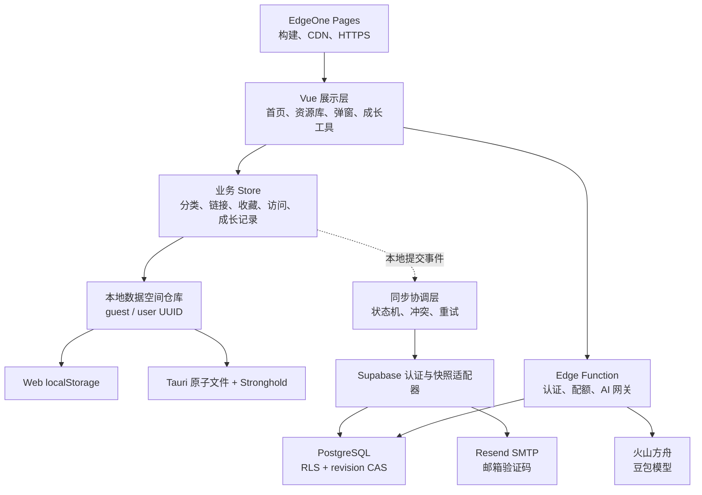
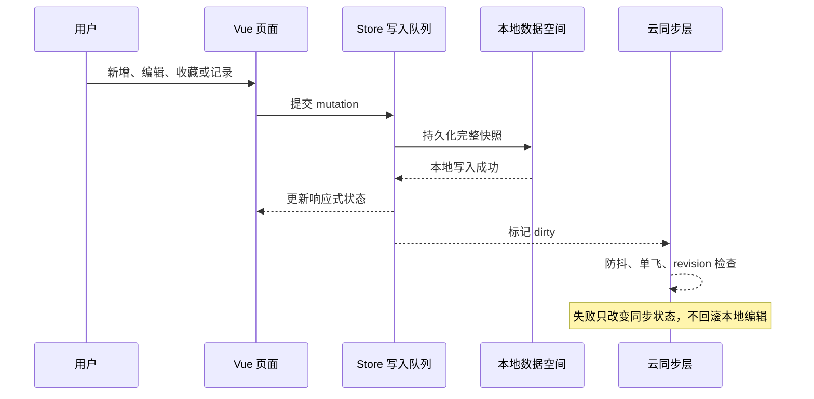

# 潘多拉：一次从想法到可发布产品的 Vibe Coding 全链路实践

> 项目定位：面向家庭成长场景的本地优先资源库，帮助家长按成长阶段整理、筛选、收藏和使用育儿资源。
>
> 技术形态：Vue 3 Web 应用 + Tauri 2 桌面应用，采用本地优先存储，并通过 Supabase 提供账号与跨设备同步。
>
> 线上地址：[www.nurtureprimer.com](https://www.nurtureprimer.com/)
>
> 文档基线：2026-08-19。本文根据项目代码、Git 历史、设计文档、任务清单、Review 记录和线上验证结果整理。

---

## 1. 项目摘要

“潘多拉”最初是一个带娃百科导航工具，核心想法很直接：把分散在浏览器收藏夹、聊天记录、公众号和搜索引擎里的家庭成长资料，整理成一个能长期维护、随时查找的个人资源库。

项目随后逐步从“链接导航”演进为“家庭成长资源工作台”：

- 按孩子所处成长阶段筛选内容；
- 通过分类、搜索、标签、收藏和访问统计管理资源；
- 使用 AI 成长助手辅助检索和整理问题；
- 提供疫苗接种攻略、生长记录与趋势图等场景化工具；
- 在 Web 与桌面端保持本地可用、离线可用；
- 在不破坏本地体验的前提下，提供可选账号和跨设备同步能力。

它不是一次性生成的 Demo，而是一个典型的 Vibe Coding 演进案例：先快速把想法做出来，再通过规格化需求、任务拆解、代码审查、自动测试和发布门禁，把“能跑”持续收敛为“可用、可靠、可维护”。

## 2. 为什么要做这个项目

### 2.1 用户痛点

家庭成长信息通常有几个共同问题：

1. **信息分散**：资料存在于不同网站、聊天记录和收藏夹中，真正需要时很难快速找回。
2. **年龄不匹配**：婴幼儿、学龄期、青春期关注点差异很大，通用搜索结果需要再次筛选。
3. **缺少个人上下文**：普通导航站不知道用户关注的成长阶段，也不能沉淀家庭自己的资源和记录。
4. **长期维护困难**：收藏越来越多后，分类、去重、备份和迁移都会变成负担。
5. **隐私与可用性顾虑**：成长记录属于个人数据，核心功能不应该因为登录失败或网络中断而不可用。

### 2.2 产品目标

潘多拉希望提供一种更轻量的解法：

- 打开即用，不强制注册；
- 内容围绕成长阶段组织，而不是简单堆链接；
- 个人数据先写本地，网络和云服务不是核心功能的前置条件；
- 用户可以导入、导出和恢复数据；
- Web 与桌面端共享主要交互和业务逻辑；
- 账号与同步能力不推翻原有本地架构。

### 2.3 一句话价值主张

> 把分散的家庭成长资源整理得更清楚，让真正需要的信息更快被找到。

## 3. 当前产品能力

### 3.1 已可使用的功能

| 能力 | 说明 | 主要实现 |
|---|---|---|
| 成长阶段筛选 | 根据所选阶段同步筛选首页内容和资源库 | `CategoryNav.vue`、`Dashboard.vue`、`LinkList.vue` |
| 家庭成长资源库 | 支持搜索、分类、标签、收藏、最近收录和访问统计 | `App.vue`、`SearchBar.vue`、`LinkList.vue` |
| 分类与资源管理 | 支持新增、编辑、删除分类、子分类和资源 | `CategoryManager.vue`、`CategoryModal.vue`、`LinkModal.vue` |
| 首页概览 | 展示分类数、资源数、收藏数、今日收录和五类内容 Tab | `Dashboard.vue` |
| AI 成长助手 | 在站内直接提问，通过服务端网关调用豆包模型；部署配置完成后启用 | `AISearch.vue`、`aiAssistantClient.js` |
| 疫苗接种攻略 | 提供分阶段时间表、补种原则、接种提示和官方来源 | `VaccineGuide.vue`、`vaccineGuide.js` |
| 生长曲线 | 记录身高、体重、可选头围，展示趋势、变化和历史记录 | `GrowthTracker.vue`、`growthChart.js` |
| 数据导入导出 | 使用 JSON 完整快照备份和恢复业务数据 | `App.vue`、`store.js` |
| 本地优先持久化 | Web 使用浏览器存储，Tauri 使用本地文件 | `dataSpaceRepository.js`、`src-tauri/src/lib.rs` |
| 账号与云同步 | 支持邮箱验证码登录、跨设备同步、冲突处理和恢复副本 | `AccountCenter.vue`、`syncCoordinator.js` |
| 响应式与可访问性 | 支持桌面、平板和手机布局，补充键盘、焦点和减少动效能力 | 全局样式与各 Vue 组件 |

### 3.2 账号与云同步

账号与云同步已经形成可用闭环：

- 不登录时数据保存在当前设备，核心功能可离线使用；
- 登录后按用户隔离数据空间，并自动同步到云端；
- 多设备同时修改时通过 revision 检测冲突，避免静默覆盖；
- 覆盖或恢复前自动保留恢复副本；
- 云端或网络异常不会回滚已经保存的本地数据。

因此，当前可对外准确描述为：**本地优先、登录可选、云端同步、异常不丢数据。**

### 3.3 仍在规划或开发中的入口

首页会根据成长阶段展示辅食、睡眠、入园、学习、亲子沟通等快捷入口。目前疫苗接种和生长曲线已有完整交互，其他部分入口仍会提示“功能开发中”。这种做法保留了产品信息架构，但发布说明中需要避免把占位入口写成已完成功能。

## 4. 技术选型与系统架构

### 4.1 技术栈

| 层次 | 技术 | 选择原因 |
|---|---|---|
| 前端框架 | Vue 3 Composition API | 组件化清晰，响应式状态适合中小型工具应用 |
| 构建工具 | Vite 5 | 开发启动快，静态构建简单，适合 Web 与 Tauri 共用 |
| 样式 | 原生 CSS + 语义变量 | 不增加 UI 框架体积，便于塑造独立视觉风格 |
| 图标 | Lucide Vue Next | 图标风格统一，覆盖导航和工具类场景 |
| 桌面容器 | Tauri 2 + Rust | 复用 Web UI，同时获得本地文件和安全存储能力 |
| 本地数据 | localStorage / Tauri 文件 | 保持打开即用和离线可用 |
| 账号与数据服务 | Supabase Auth + PostgreSQL + PostgREST | 提供邮箱登录、数据 API、RLS 权限隔离和版本化快照 |
| 邮件服务 | Resend SMTP | 向用户发送登录验证码 |
| AI 网关与模型 | Supabase Edge Functions + 火山方舟 | 保护模型密钥、控制每日额度并返回站内回答 |
| Web 托管与加速 | 腾讯云 EdgeOne Pages | 自动构建 Vite、托管静态站点、提供 CDN 与 HTTPS |
| 域名与解析 | 腾讯云域名 + DNSPod | 管理 `nurtureprimer.com` 及 DNS 记录 |
| 代码与自动部署 | GitHub | 保存源码，并在 `main` 更新后触发线上构建 |
| 自动测试 | Node.js 内置测试运行器、Rust Test、pgTAP 设计 | 尽量减少测试框架依赖，分别覆盖前端逻辑、原生存储和数据库权限 |

### 4.2 总体架构



架构中的关键约束是依赖单向：页面不直接访问 Supabase，业务 Store 不感知 Token，云同步也不能成为本地写入的前置条件。

### 4.3 本地优先数据流



这个顺序保证了两个体验底线：页面操作反馈不依赖网络；远端故障不会破坏已经成功写入的本地数据。

### 4.4 数据设计

业务快照以版本化整体数据为中心：

```text
Snapshot
├── schemaVersion
├── categories[]
├── links[]
└── growthRecords[]
```

账号、设备、远端 revision、同步状态和 Session 不进入业务快照，而是放在数据空间封装或独立安全存储中。这样做有三个好处：

1. 导入导出格式继续保持简单；
2. 业务数据不会被云厂商对象污染；
3. 本地存储、云同步和 UI 可以分别演进。

## 5. 前端样式与体验设计

### 5.1 设计方向

早期页面更接近灰白色后台工具。视觉焕新的目标不是“做得更花”，而是让家长更快看懂页面的主次关系，同时建立清新、温暖、不过度幼稚的家庭成长氛围。

最终采用了“薄荷绿主色 + 暖色强调 + 低饱和背景 + 多彩局部标签”的视觉语言：

- 大面积背景保持柔和，降低长时间阅读压力；
- 颜色主要用于阶段、图标、状态和局部边框；
- 统一圆角、阴影、表单、按钮、弹窗和焦点样式；
- 使用 Lucide 图标、渐变和 CSS 装饰，不加载外部字体或远程图片；
- 避免大面积持续动画和高成本滤镜，兼顾 Tauri WebView 性能。

### 5.2 页面信息层级

首页被重新组织为四层：

1. **一级信息**：当前成长阶段和今日提醒；
2. **二级操作**：分类、全部资源、收藏和今日收录统计；
3. **核心内容**：实用工具、最近收录、热门主题、精选资源、我的收藏五个 Tab；
4. **辅助能力**：站内 AI 成长助手放在页面底部，不抢占核心内容入口。

这次调整解决了首页区块纵向堆叠、入口互相竞争的问题。移动端的 Tab 可以横向滚动，桌面端则平均分布。

### 5.3 响应式策略

项目重点验证以下视口：

| 视口 | 关注点 |
|---|---|
| 1440 × 900 | 大屏内容宽度与留白 |
| 1200 × 800 | Tauri 默认窗口 |
| 992 × 768 | 中间宽度 Tab 与双栏边界 |
| 768 × 1024 | 移动导航切换和单栏布局 |
| 390 × 844 | 手机工具栏、卡片、弹窗和触屏操作 |

响应式主要由 CSS 媒体查询承担，没有引入 JavaScript 尺寸监听。这样既降低复杂度，也避免运行时布局抖动。

### 5.4 交互和可访问性

视觉不是只看截图，项目还补齐了以下细节：

- 所有主要操作具有清晰的 `:focus-visible` 状态；
- Tab 支持左右方向键、Home 和 End；
- 弹窗支持 Escape、焦点约束和关闭后的焦点恢复；
- 移动侧栏关闭后从键盘顺序和辅助技术中移除；
- 触屏环境不依赖 hover 才显示管理操作；
- 支持 `prefers-reduced-motion`，减少非必要动效；
- 外链仅接受 HTTP(S)，并隔离新窗口的 opener；
- AI 回答不使用 `v-html`，避免远端内容直接注入 DOM。

## 6. Vibe Coding 全链路过程

### 6.1 阶段一：从真实问题出发，而不是从技术出发

最初需求可以压缩为一句话：**做一个适合自己家庭使用、能按年龄整理育儿资料的导航工具。**

Vibe Coding 的优势是可以用自然语言快速得到第一个可交互版本。此时目标不是一次性确定完美架构，而是验证三个最核心的问题：

- 首页能不能让用户快速理解产品；
- 分类和链接是否比浏览器收藏夹更好用；
- 年龄筛选是否真的能减少查找成本。

项目在 2026-07-07 创建初始版本，2026-07-14 增加 AI 搜索。这个阶段体现了 Vibe 的“快速可见反馈”：先让想法落地，再基于真实页面继续提要求。

### 6.2 阶段二：让 AI 先理解仓库

当功能开始增多后，继续使用“帮我优化一下页面”这类宽泛提示，风险会迅速上升。后续迭代改为先让 AI 阅读：

- 项目目录和依赖；
- `App.vue` 的页面编排；
- `store.js` 的数据契约；
- 组件 props / emits；
- Vite、Tauri 和发布配置；
- 当前 Git diff，避免覆盖已有未提交修改。

这一步的本质是把 AI 从“无上下文代码生成器”变成“理解现状后再动手的协作者”。

### 6.3 阶段三：把自然语言整理成 Spec

视觉焕新和账号同步都先形成了独立 `spec.md`。一个可执行的 Spec 至少回答：

1. 当前问题是什么；
2. 用户目标是什么；
3. 哪些事情本期不做；
4. 功能与非功能要求是什么；
5. 模块边界、接口和数据模型如何设计；
6. 如何测试、观测、发布和回滚。

“非目标”非常重要。例如账号同步明确不建设自有业务后端、不把 AI Key 放进云快照、不做多人协作；视觉改造明确不引入完整 UI 框架、不依赖外部字体和图片。边界越清楚，AI 越不容易在实现时无控制地扩大范围。

项目中的两个规格样本：

- [家长端页面视觉焕新](./design-docs/frontend/visual-refresh/spec.md)
- [本地优先账号与云端同步](./design-docs/platform/account-sync/spec.md)

### 6.4 阶段四：先设计依赖和失败路径

系统设计不只描述正常流程，还要主动问“失败时会发生什么”：

- 本地保存失败，弹窗能否继续关闭？
- 多次并发修改会不会互相覆盖？
- Tauri 文件损坏后是否有恢复副本？
- 云端 revision 冲突时是否会静默覆盖？
- Session 过期或网络超时是否会阻塞首屏？
- 配置缺失时能否自然降级为纯本地模式？

账号同步最终采用“业务 Store + 本地数据空间 + 同步协调层 + 云端适配器”的分层，而不是让组件或 Store 直接调用 Supabase。这个决定增加了一些代码，但换来了更清楚的故障边界。

### 6.5 阶段五：把大需求切成可验收任务

Spec 之后不直接开始大规模改代码，而是生成 `tasks.md`，为每个任务明确：

- 修改哪些文件；
- 依赖哪个前置任务；
- 对应 Spec 哪一节；
- 不能破坏哪些接口；
- 自动化和人工验收标准；
- Code Review 是否通过。

视觉焕新被拆为主题基础、Dashboard、资源库、集成验证、Tab、安全加固、性能维护、信息清晰度、分类直达、疫苗攻略和生长曲线等 11 个阶段；账号同步则按基础契约、数据空间、Tauri 存储、数据库、适配器、同步状态机、应用门面、UI 和部署交付逐层推进。

对应任务样本：

- [视觉焕新任务清单](./design-docs/frontend/visual-refresh/tasks.md)
- [账号同步任务清单](./design-docs/platform/account-sync/tasks.md)

### 6.6 阶段六：小步实现，每一步都保留可运行状态

每个任务遵循相同节奏：

```text
读取任务上下文
  → 确认现有契约和 dirty worktree
  → 做最小范围修改
  → 运行聚焦测试
  → 运行生产构建
  → 检查 diff
  → 进入 Review
```

这种方式避免一次生成几十个文件后才发现方向错误。一个任务失败时，影响范围也更容易定位。

### 6.7 阶段七：用 Review 让 AI 反驳 AI

项目中的 Review 不是“看起来没问题”，而是从 correctness、robustness、security、performance、contract 和 spec compliance 等角度寻找反例，并按优先级处理。

视觉安全加固任务经历了三轮 Review，曾发现：

- P0：一条旧的不安全 URL 可能导致整包用户数据回退；
- P1：Tauri 2 环境识别错误；
- P1：并发异步写入可能互相覆盖；
- P1：分类弹窗在持久化完成前关闭；
- P1：初始化流程绕过统一写入队列。

云端适配器经历了四轮 Review，曾发现：

- P0：未来 Schema 可能被规范化器静默降级；
- P1：远端调用没有覆盖完整响应体的 deadline；
- P1：认证 listener 异常可能触发重复状态转换；
- P0：对 204 响应的重建方式违反 Fetch 约束。

这些问题很难仅靠“页面能打开”发现。Review 的价值是持续构造反例，并把修复结果沉淀进测试。

Review 样本：

- [安全与数据可靠性 Review](./design-docs/frontend/visual-refresh/reviews/task6-review.md)
- [Supabase 适配器 Review](./design-docs/platform/account-sync/reviews/task5-review.md)

### 6.8 阶段八：把测试当作项目记忆

Vibe Coding 常见风险是：每次改动都很快，但 AI 不会天然记住以前修过的所有边界。自动测试就是项目的长期记忆。

当前测试覆盖重点包括：

- 配置缺失、特权 Key 拒绝和生产 URL 约束；
- Schema、快照大小、哈希和确定性序列化；
- 游客与用户数据空间隔离；
- 旧数据迁移、损坏隔离和恢复副本；
- Store 串行写入、访问批处理和失败重试；
- 安全外链、严格导入和分类持久化；
- Stronghold Session 适配器和 Tauri 错误语义；
- OTP、Session、云端 load/create/CAS 和超时；
- Supabase RLS、权限和 revision 数据库契约。

测试不是项目完成后补的一张报表，而是在每次 Review 发现问题后增加的防回归约束。

### 6.9 阶段九：发布不是一个按钮，而是一组门禁

项目把发布拆为四层：

1. **代码门禁**：测试、构建、格式和 diff 检查；
2. **Web 门禁**：生产静态构建、关键视口、核心流程和控制台日志；
3. **桌面门禁**：Rust 检查、原生测试、Tauri 打包和安装验证；
4. **云端门禁**：迁移、RLS/pgTAP、OTP、双客户端冲突和回滚演练。

只有启用到哪一层，才宣称对应能力已发布。这也是为什么当前文档将本地版与云同步版分开描述。

## 7. 可复用的 Vibe 提示词结构

以下内容是根据项目过程整理的可复用模板，不是历史对话的逐字记录。

### 7.1 仓库理解提示词

```text
请先阅读项目目录、package.json、入口组件、数据 Store、构建和发布配置。
总结当前架构、主要功能、数据流、风险和未提交改动。
在我确认前不要修改代码，也不要覆盖工作区已有变更。
```

### 7.2 需求规格提示词

```text
我要解决的问题是：……
目标用户是：……
必须完成：……
明确不做：……
请先输出包含背景、目标、需求、非目标和验收标准的 Spec。
先讨论问题和边界，不要直接生成代码。
```

### 7.3 前端设计提示词

```text
在不改变现有业务契约和数据流的前提下，优化页面信息层级和视觉风格。
目标氛围是清新、温暖、适合家长，但不要过度幼稚。
必须覆盖 1200×800、992×768、768×1024、390×844，
并检查键盘焦点、触屏操作、文字对比度和减少动效。
不要引入外部字体、远程图片或新的 UI 框架。
```

### 7.4 实现任务提示词

```text
基于已经确认的 Spec 生成任务清单。
每个任务写明文件范围、依赖、Spec 映射、风险、验收标准和测试命令。
按依赖顺序一次只实施一个任务；每完成一个任务都运行测试、构建和 diff 检查。
```

### 7.5 Review 提示词

```text
请从正确性、健壮性、安全、性能、接口契约和 Spec 符合度审查本次改动。
优先寻找会造成数据丢失、权限绕过、并发覆盖、失败假成功和兼容性回退的问题。
所有问题给出文件位置、复现路径、优先级和最小修复建议。
修复后重新审查，直到没有未处理的 P0/P1。
```

### 7.6 发布提示词

```text
请根据当前技术栈生成发布门禁和回滚步骤。
区分 Web、Tauri 和 Supabase；不得把没有实际验证的能力描述为已发布。
检查构建产物、环境变量、CSP、日志和前端代码中是否包含敏感密钥。
输出执行结果、未执行项、阻塞条件和回滚方式。
```

## 8. 测试与质量保障

### 8.1 最近一次实测结果

2026-08-19 在当前工作区执行：

| 检查项 | 结果 | 说明 |
|---|---|---|
| `npm test` | **PASS** | 129/129 通过，0 失败 |
| `npm run build` | **PASS** | Vite 生产构建成功 |
| HTML/CSS/JS 产物 | **PASS** | 生产资源已生成，体积在构建日志中持续检查 |
| `cargo test` | **PASS** | Rust 9/9 通过 |
| Supabase pgTAP | **PASS** | 账号同步与 AI 配额共 55 项断言通过 |

此外，`cargo fmt --check`、`cargo check`、Node 语法检查和 Git diff 检查均已通过。

### 8.2 当前测试分层

| 层次 | 文件或命令 | 主要目的 |
|---|---|---|
| 业务与安全 | `tests/system-hardening.test.js` | 数据迁移、导入、外链、队列和批处理 |
| 账号基础 | `tests/account-foundations.test.js` | 配置、错误、快照、诊断和脱敏 |
| 数据空间 | `tests/data-spaces.test.js` | 隔离、恢复、设备 ID 和性能边界 |
| 云适配器 | `tests/cloud-adapters.test.js` | OTP、Session、远端快照、CAS 和 deadline |
| AI 客户端 | `tests/ai-assistant-client.test.js` | Session、游客标识、单飞、deadline 和错误映射 |
| AI 网关 | `tests/ai-function-core.test.js` | 输入、CORS、身份、配额编排和火山方舟适配 |
| Tauri 适配 | `tests/tauri-storage.test.js` | Stronghold、原生桥接和错误映射 |
| Rust 原生层 | `cargo test` | 原子写、salt、隔离和文件边界 |
| 数据库权限 | `supabase/tests/account_sync.sql`、`ai_usage_quota.sql` | RLS、CAS、配额权限和真实竞态 |
| 生产构建 | `npm run build` | Vue 模板、依赖和打包完整性 |
| 人工冒烟 | 关键视口与核心流程 | 验证真实页面交互和视觉边界 |

### 8.3 推荐发布前命令

```bash
npm ci
npm test
npm run build
npm run preview
```

具备 Rust 工具链时再执行：

```bash
cargo fmt --manifest-path src-tauri/Cargo.toml --check
cargo check --manifest-path src-tauri/Cargo.toml
cargo test --manifest-path src-tauri/Cargo.toml
npm run tauri build
```

云同步发布前还应在隔离环境执行数据库权限测试，并完成人工双客户端冲突验证。

## 9. 发布方案

### 9.1 Web 发布

Web 版本已部署到腾讯云 EdgeOne Pages，正式地址为 [www.nurtureprimer.com](https://www.nurtureprimer.com/)。

推荐流程：

1. 在干净环境执行 `npm ci`、`npm test` 和 `npm run build`；
2. EdgeOne 从 GitHub `main` 分支自动构建 `dist`；
3. 使用 Preview 环境验证首页、资源库、导入导出和移动端布局；
4. 检查浏览器控制台、静态资源和缓存行为；
5. 将通过验证的同一提交提升到 Production；
6. 若出现回归，回滚到上一份已验证的静态构建。

EdgeOne 同时负责 CDN、HTTPS 证书和 HTTP 到 HTTPS 跳转；域名解析由腾讯云 DNSPod 管理。

### 9.2 Tauri 桌面发布

Tauri 配置定义了 1200 × 800 默认窗口和全平台 Bundle 目标。桌面发布除前端测试外，还应验证：

- macOS、Windows 等目标平台能否成功打包和启动；
- 首次创建、旧数据迁移和异常退出后数据是否完整；
- Stronghold 不可用时是否只降级账号 Session，而不影响业务数据；
- 安装包签名、公证、版本号和升级策略；
- CSP 是否只允许业务真正需要的远端来源。

### 9.3 Supabase 与云同步发布

云能力按以下顺序发布：

1. 先部署数据库迁移、RLS 和 CAS 函数；
2. 验证匿名用户无权读取或写入快照；
3. 配置 OTP 邮件和公开客户端 Key；
4. 只向前端提供 publishable/anon Key，禁止 service-role Key；
5. 发布同步协调器和账号 UI；
6. 使用两个浏览器或设备验证首次迁移、离线修改、revision 冲突和三种解决策略；
7. 验证完成后再逐步放量。

生产环境使用的前端配置包括：

```text
VITE_SYNC_ENABLED
VITE_SUPABASE_URL
VITE_SUPABASE_PUBLISHABLE_KEY
VITE_AI_ENABLED
VITE_AI_REQUEST_TIMEOUT_MS
VITE_TELEMETRY_ENABLED
VITE_TELEMETRY_ENDPOINT
```

任何环境中都不应把数据库密码、SMTP 凭据或 Supabase service-role Key 注入前端构建。

## 10. 项目演进时间线

| 时间 | 里程碑 | 说明 |
|---|---|---|
| 2026-07-07 | 初始版本 | 创建“潘多拉带娃百科导航工具” |
| 2026-07-14 | AI 搜索 | 增加豆包和 OpenAI 两种模式，并修正 Vercel 配置 |
| 2026-07-30 | 视觉焕新规格完成 | 从后台工具感转向清新、亲和的家庭成长体验 |
| 2026-07-30 后 | 功能与质量加固 | 增加 Tab、安全边界、疫苗攻略、生长曲线和自动测试 |
| 2026-07-31 | 账号同步规格 | 确立本地优先、数据空间、RLS、CAS 和渐进式同步架构 |
| 2026-08-19 | Web 正式上线 | EdgeOne Pages、腾讯云域名、DNSPod、Supabase 与 Resend 完成联调 |
| 2026-08-19 | 站内 AI 改造 | 增加 Edge Function AI 网关、每日额度和火山方舟适配 |
| 当前 | 本地与云端均可用 | 未登录保持本地优先，登录后支持账号隔离和跨设备同步 |

## 11. Vibe Coding 带来的收益

### 11.1 从想法到页面的反馈速度更快

自然语言能迅速转化为可交互界面，适合个人项目在早期验证信息架构和真实需求。

### 11.2 一个人也能覆盖多个工程角色

在同一个迭代中，AI 可以协助需求整理、前端设计、数据建模、Rust 存储、SQL 权限、测试和 Review。人不需要亲自写下每一行代码，但仍要掌握方向和最终裁决。

### 11.3 文档、代码和测试可以同步演进

Spec 说明“为什么”，Tasks 说明“怎么拆”，Review 说明“哪里错过”，Tests 说明“以后不能再错”。四者组合后，项目不会只剩一堆难以解释的代码。

## 12. 过程中的关键反思

### 12.1 Vibe 不等于一句提示词生成整个系统

原型阶段可以宽松，进入数据、账号和发布阶段后必须增加规格、边界和门禁。提示词越接近验收标准，结果越稳定。

### 12.2 人必须保留产品和风险裁决权

AI 可以建议架构，但“是否需要登录”“哪些数据允许上传”“医疗内容如何免责声明”“什么时候可以称为已发布”仍然需要人负责。

### 12.3 能运行不代表能发布

页面成功打开只能证明最短正常路径。并发覆盖、损坏恢复、权限边界、204 响应和未来 Schema 等问题，往往只能通过 Review 和反例测试发现。

### 12.4 本地优先是产品选择，也是工程约束

它带来离线和低延迟体验，也要求处理数据空间、恢复副本、最终一致性和冲突。不能一边宣传“本地优先”，一边让登录或网络阻塞首屏。

### 12.5 应如实表达完成度

个人项目分享最有价值的部分，不只是展示做成了什么，也包括说明哪些能力仍在建设、为什么尚未发布，以及下一步如何完成。

## 13. 下一步计划

下一阶段重点：

1. 补齐精确 Tauri CSP、环境示例和部署文档；
2. 完成 Tauri、数据库和双客户端全链路验证；
3. 完成未实现快捷工具，或隐藏仍在规划中的占位入口；
4. 建立 CI，让 Node、Rust、数据库测试和生产构建成为合并门禁。

## 14. 分享结语

潘多拉最值得分享的，不只是“用 AI 做了一个育儿工具”，而是完整展示了个人项目如何逐步获得工程质量：

> 想法给出方向，Vibe 负责加速；Spec 固定边界，Tasks 控制节奏；Review 主动找错，Tests 保留记忆；发布门禁决定什么时候可以对用户负责。

这套过程的最终目标并不是让 AI 替代开发者，而是让一个人也能以产品、设计、开发、测试和运维的完整视角，把一个真实想法持续做深。

---

## 附录：项目关键文件索引

| 内容 | 路径 |
|---|---|
| 应用入口 | `src/App.vue`、`src/main.js` |
| 首页体验 | `src/components/Dashboard.vue` |
| 资源库 | `src/components/LinkList.vue`、`src/components/SearchBar.vue` |
| AI 助手 | `src/components/AISearch.vue` |
| 疫苗攻略 | `src/components/VaccineGuide.vue`、`src/data/vaccineGuide.js` |
| 生长曲线 | `src/components/GrowthTracker.vue`、`src/utils/growthChart.js` |
| 业务 Store | `src/data/store.js` |
| 数据空间 | `src/data/dataSpaceRepository.js` |
| Tauri 原生层 | `src-tauri/src/lib.rs` |
| 云端认证 | `src/account/authAdapter.js`、`src/account/supabaseClient.js` |
| 账号与同步 UI | `src/components/AccountCenter.vue`、`src/account/accountSyncFacade.js` |
| 同步协调 | `src/sync/syncCoordinator.js`、`src/sync/crossTabLock.js` |
| 云端快照 | `src/sync/cloudSnapshotRepository.js` |
| 站内 AI | `src/ai/aiAssistantClient.js`、`supabase/functions/ai-growth-assistant/` |
| AI 配额 | `supabase/migrations/202608190002_ai_usage_quota.sql` |
| 数据库迁移 | `supabase/migrations/202607310001_account_sync.sql` |
| 自动测试 | `tests/`、`supabase/tests/account_sync.sql` |
| Web 构建 | `package.json`、`vite.config.js`；产物由 EdgeOne Pages 托管 |
| Tauri 发布 | `src-tauri/tauri.conf.json` |
